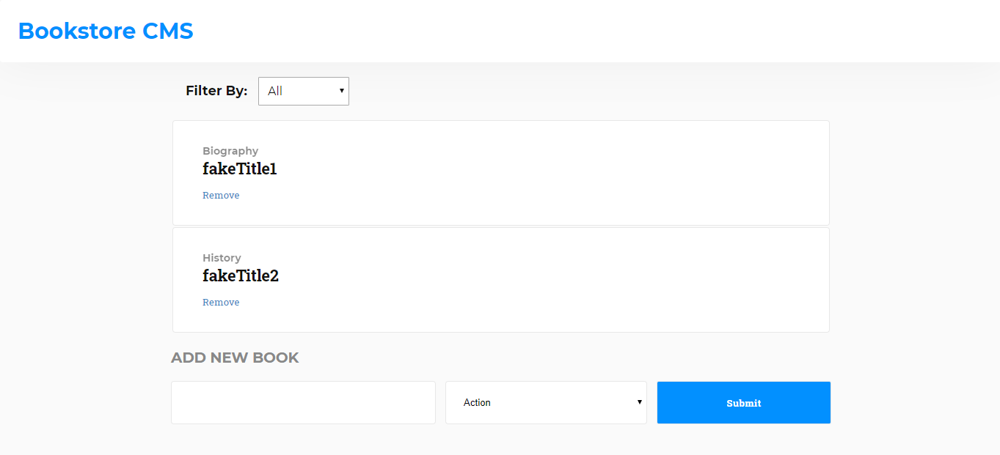

# Bookstore
Book Store app made using react and redux. It will help you organize and manage bookstore.

## Build Using
- React
- Redux

### 🔥  [Demo](https://bookstore-cms-demo.herokuapp.com/)

## Screenshot



## Get Started 

*Clone the repo to your local machine*
```bash
    git clone https://github.com/DanielMitiku/bookstore.git
    cd bookstore
```

*Install `npm` packages and start development server*

```bash
    npm install
    npm start
```

## Contributors

- [Daniel Mitiku](https://github.com/DanielMitiku)
- [Pon Muthu Selvam](https://github.com/imhta)


#### Feel free to make PR :heart:
